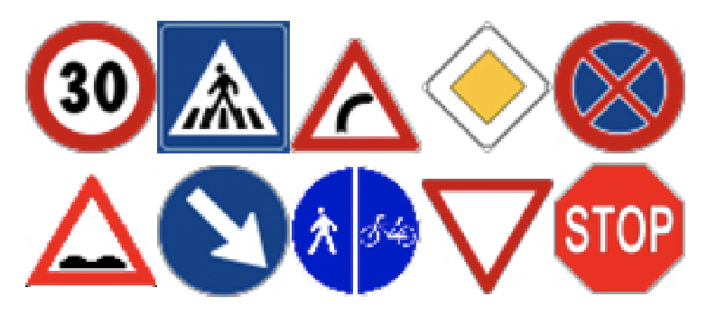

#  __Traffic Sign Classification__
### __University of Verona__
A simple Pattern Recognition project. The traffic signs we used are the following.

## Setup & Run
Download the repository then extract it where you prefer. Using the `cd` command go to the repository path.
You can now use `python3` to run the scripts contained in the `code` folder. <br>
At first you need to extract the images contained in the `dataset` folder and convert it to `.npy` file. To do this simply run
```
python3 code/export_dataset.py
```

The next step is to convert those images into features. We use __Keras__ features provided by the <a href="https://keras.io/applications/#xception">__Xception__</a> application.<br>
Run this script to save a `.npy` file containing the features
```
python3 code/keras_features.py
```
Now we can train our __SVM__ classifier with the previosly extracted features by running
```
python3 code/svm_classifier.py
```
It will save a `.sav` file containing the classifier.
Now we have the traffic signs classifier, you can just use it by passing traffic sign images, it will give you the predicted class (type int from 0 to 10). <br>
We tested it on a video (inside the `video` folder, it's `test_video.mp4`). To try it youself you need to selet the first frame containing the sign's bouding-box running
```
python3 code/TODO.py
``` 
NOTE: press __n__ to stop the video and let you select the boungin-box, then press __enter__ to continue through the video.<br><br>
Once the video is over you can watch the classifier at work by running
```
python3 code/test_on_video.py
```
At the end it will save the output video inside the `video` folder as `output_video.avi`.