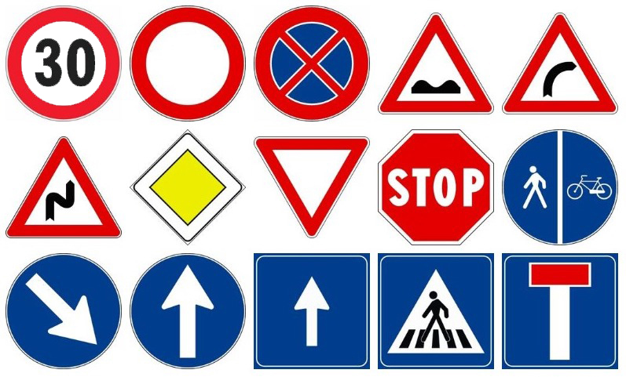

#  __Traffic Sign Classification__ [](https://github.com/edoardopieropan/ttr_traffic_sign_classification/edit/master/LICENSE)
### __University of Verona__
A simple Pattern Recognition project without using CNN methods. The traffic signs we work on are the following.

## How it works
Most of the dataset is based on <a href="https://www.kaggle.com/meowmeowmeowmeowmeow/gtsrb-german-traffic-sign">German Traffic Sign Dataset</a>, <a href="https://btsd.ethz.ch/shareddata/">BelgiumTS Dataset</a>, <a href="https://daus-lab.github.io/spanish-traffic-sign-dataset/">Spanish Traffic Sign Dataset</a>. We also used data augmentation, file in `code` folder named `data_augmentation`, to exapand to 600 per class the images. The feature we used are from __Keras__ application.
## Setup & Run
Download the repository then extract it. Using the `cd` command go to the repository path.<br>
First of all install the requirements: 
```
pip install -r requirements.txt
```
You can now use `python3` to run the scripts contained in the `code` folder.<br>

At first you need to extract the images contained in the `dataset` folder and convert it to `.npy` file. To do this simply run
```
python3 code/export_dataset.py
```

The next step is to convert those images into features. We use __Keras features__ provided by the <a href="https://keras.io/applications/#xception">__Xception__</a> application.<br>
Run this script to save a `.npy` file containing those features
```
python3 code/keras_features.py
```
Now we can train our __SVM classifier__ with the previosly extracted features by running
```
python3 code/svm_classifier.py
```
It will save five `.sav` file containing the classifier for the superclass and four for the subclasses (one for each superclass).<br>
We tested it on a video (inside the `video` folder, it's `test_video.mp4`). Run this command to try it:
```
python3 code/test_on_video.py
``` 
NOTE: to try other videos you need to run `create_bbox.py` and with the key __'n'__ add only the first frame of the signal, the others will be tracked automatically.
<br>
Finally it will save the output video inside the `video` folder as `output_video.mp4`.
<br><br>
Another test is `test_on_images.py` that will cicle into the `test` folder and find the signals using a __sliding window__. Results will be stored in the folder `sliding_windows_results`.

## License
Before use it we invite you to read the LICENSE.<br >

This file is distributed under the terms of the __GNU General Public License v3.0__<br >
Permissions of this strong copyleft license are conditioned on making available complete source code of licensed works and modifications, which include larger works using a licensed work, under the same license. __Copyright and license notices must be preserved__. Contributors provide an express grant of patent rights.<br><hr>
Visit <http://www.gnu.org/licenses/> for further information.<br >

## References

***Tecniche e teorie del riconoscimento - Visual Computing*** <br >
A.Y. 2018/2019 <br >
University of Verona (Italy) <br > <br >
Repository Author: <br >
**Edoardo Pieropan** <br>
**Gianluca Pavan**
